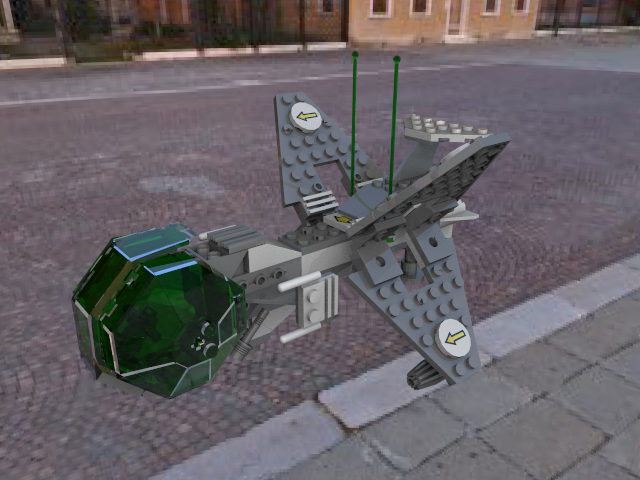
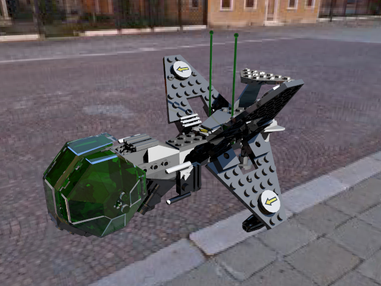
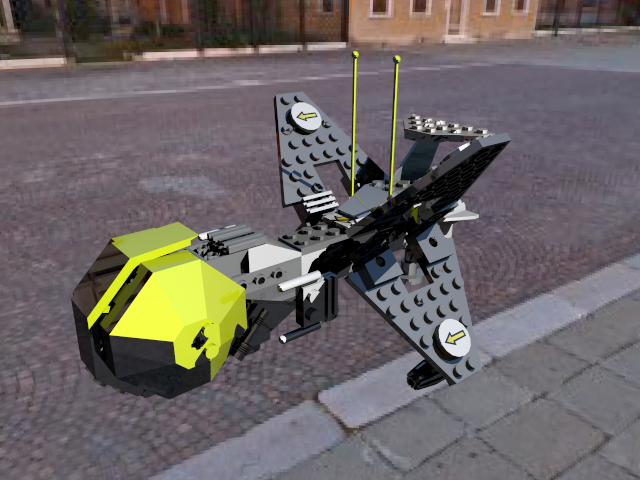
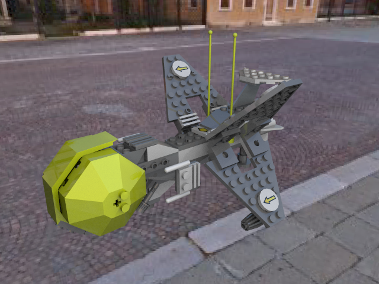
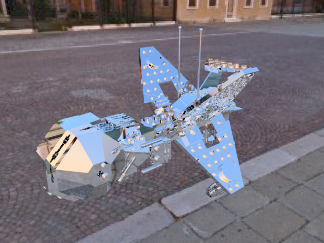
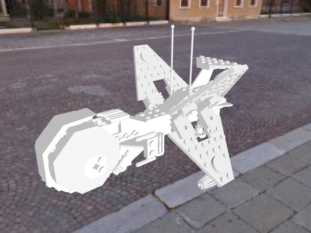
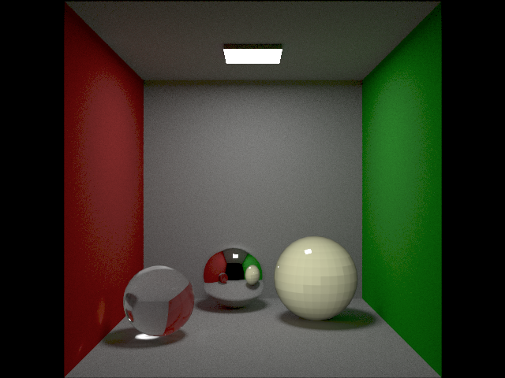

#Render results
##Spaceship
###Common shader
####Soft shadows

- 100 samples
####Hard shadows

- 90 samples

###Phong shader
####Soft shadows

- 400 samples
####Hard shadows

- 100 samples

###Mirror shader

###Normal shader

##Cornellbox
###Common shader

- 14000 samples path tracing
- Left sphere glass shader
- Middle sphere mirror shader
- Right sphere plastic phong material
